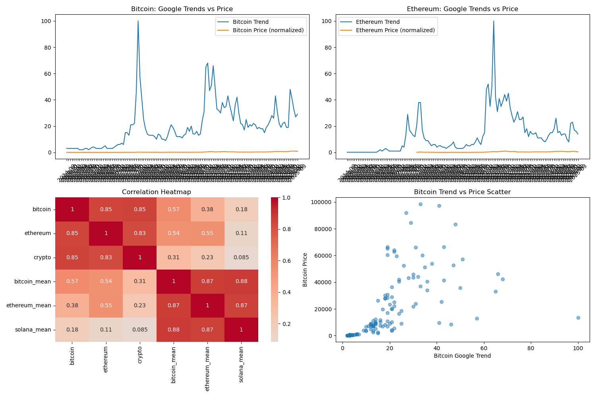
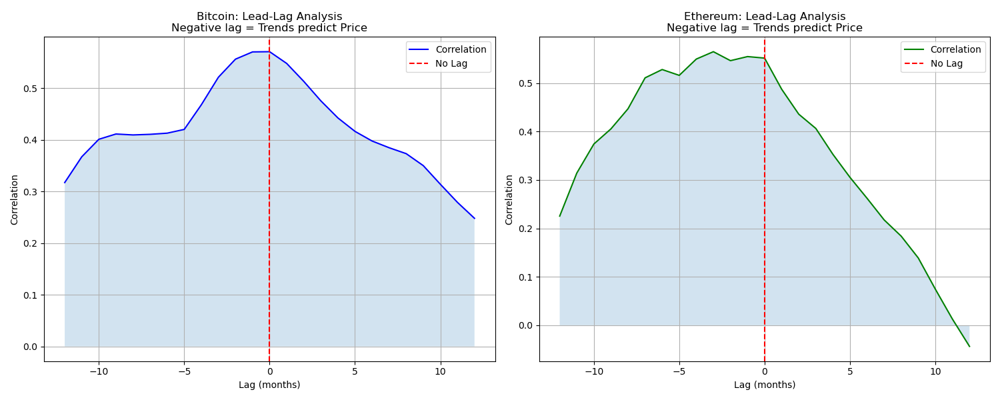
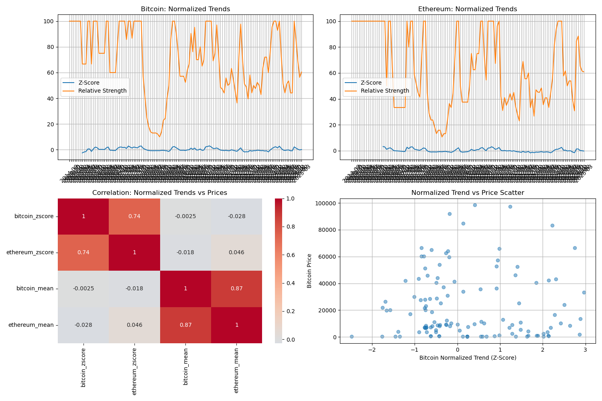
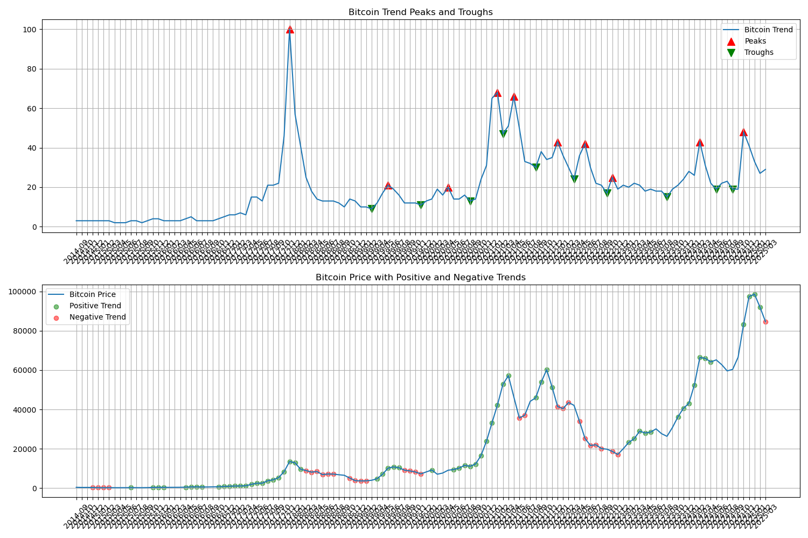
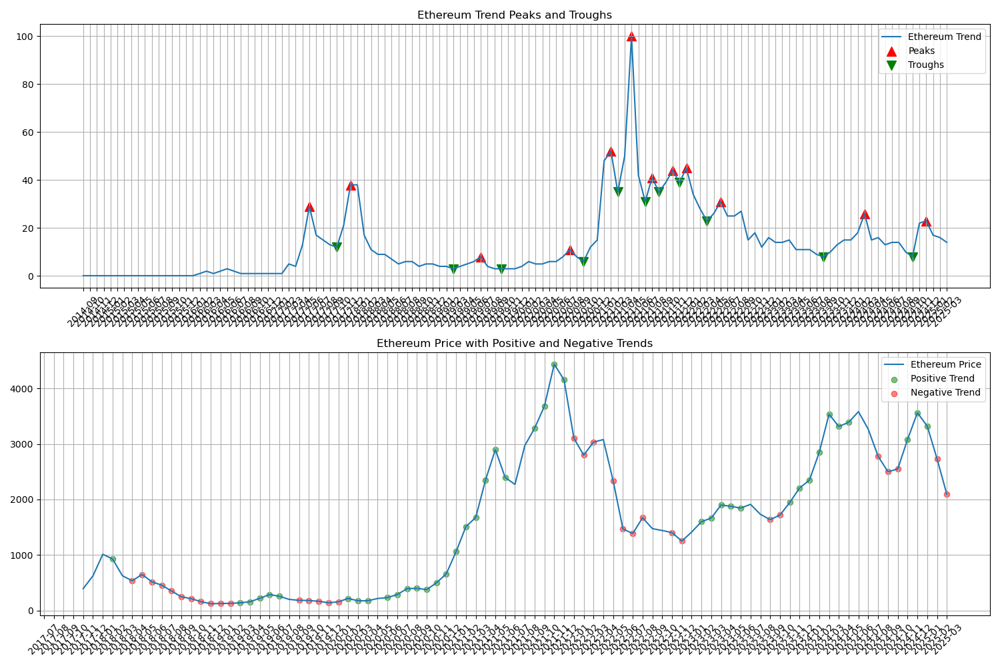
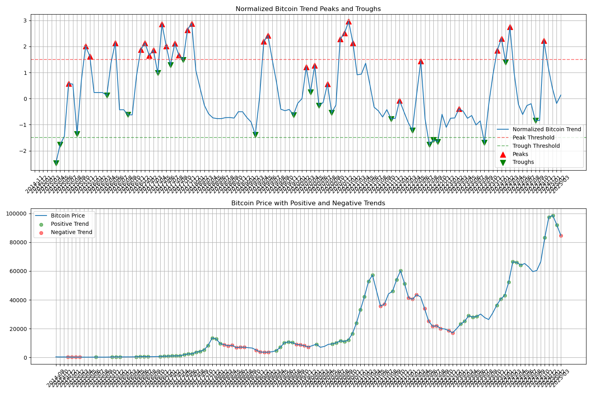
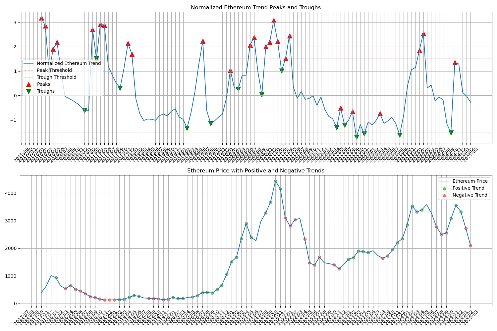
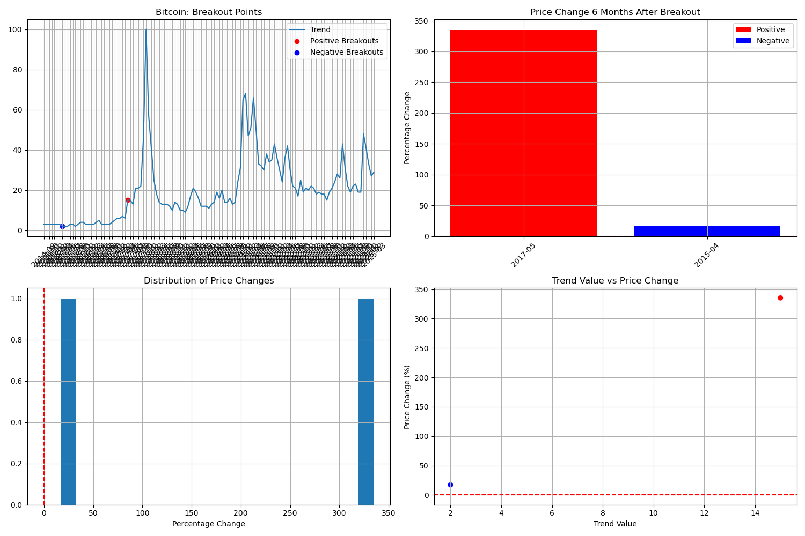

# Cryptocurrency Google Trends Analysis Report

## Executive Summary

This report analyzes the relationship between Google search interest (Google Trends data) for cryptocurrencies (Bitcoin and Ethereum) and their market prices. The analysis explores whether search interest can serve as a predictive signal for cryptocurrency price movements, providing insights for potential investment strategies.

Key findings reveal that Google Trends data shows promising predictive power, particularly when looking at troughs in search interest as potential buying signals. The analysis demonstrates that normalized Google Trends data, especially when examining search interest troughs, appears to be a more reliable indicator than peaks for predicting subsequent price movements.

## Introduction

The cryptocurrency market is known for its volatility and sensitivity to public interest. This analysis investigates whether public interest, as measured through Google search volume, can provide valuable signals about future price movements. The project examines both raw and normalized trends data across multiple time horizons to identify potential patterns.

## Methodology

The analysis employs several complementary approaches to understand the relationship between Google Trends data and cryptocurrency prices:

1. **Basic Correlation Analysis**: Quantifying direct relationships between trends and prices
2. **Lead-Lag Analysis**: Examining whether trends precede price movements or vice versa
3. **Breakout Detection**: Identifying significant spikes in search interest as potential signals
4. **Market Phase Analysis**: Studying how peaks and troughs in trends relate to subsequent bull and bear markets

For this analysis, we define bull and bear markets based on consistent price movements:
- **Bull Market**: Periods where prices consistently increase over a specific window (1, 3, or 6 months)
- **Bear Market**: Periods where prices consistently decrease over the same windows

## Data Analysis & Visualization

### 1. Correlation Analysis



This visualization shows:
- **Top Left**: Bitcoin Google Trends data (blue) versus normalized Bitcoin price (orange). The chart demonstrates periods where trends and prices move together and diverge.
- **Top Right**: Ethereum Google Trends data versus normalized Ethereum price, showing similar patterns of alignment and divergence.
- **Bottom Left**: Correlation heatmap between trends and prices for both cryptocurrencies. The correlation matrix shows moderate positive correlations between search interest and prices (Bitcoin: 0.57, Ethereum: 0.55).
- **Bottom Right**: Scatter plot showing the relationship between Bitcoin trends and prices, with each point representing a month.

The correlation analysis suggests a meaningful but not deterministic relationship between search interest and cryptocurrency prices.

### 2. Lead-Lag Analysis



This chart illustrates:
- **Left**: Bitcoin lead-lag correlation analysis. The x-axis represents lag in months (negative values indicate trends leading prices), and the y-axis shows correlation strength.
- **Right**: Ethereum lead-lag correlation analysis with the same format.

For both cryptocurrencies, the correlation peaks at negative lag values, suggesting that Google Trends data typically precedes price movements by 1-2 months, rather than following them. This provides evidence for the potential predictive power of search interest.

### 3. Normalized Trend Analysis



This visualization displays:
- **Top Panels**: Z-score and relative strength normalizations for Bitcoin (left) and Ethereum (right), which help identify unusual spikes or drops in search interest relative to recent history.
- **Bottom Left**: Correlation heatmap for normalized trends versus prices, showing that normalization maintains the meaningful correlation.
- **Bottom Right**: Scatter plot of normalized Bitcoin trend versus price.

The normalization process helps identify significant deviations in search interest that might serve as stronger signals than the raw trend data.

### 4. Bitcoin Market Phase Analysis



This chart shows:
- **Top**: Bitcoin Google Trends with peaks (red triangles) and troughs (green triangles) identified based on prominence.
- **Bottom**: Bitcoin price with positive trends (green dots) and negative trends (red dots) highlighted.

The visualization helps assess whether peaks in search interest tend to precede bear markets and whether troughs tend to precede bull markets.

### 5. Ethereum Market Phase Analysis



Similar to the Bitcoin analysis, this chart maps Ethereum's search interest peaks and troughs against its price movements, allowing for visual inspection of potential predictive relationships.

### 6. Normalized Bitcoin Market Phase Analysis



This visualization presents:
- **Top**: Normalized Bitcoin trends with peaks and troughs identified using Z-score thresholds.
- **Bottom**: Bitcoin price with positive and negative trend phases highlighted.

The normalized approach identifies more potential signals than the raw trend analysis, allowing for a more comprehensive examination of the predictive power.

### 7. Normalized Ethereum Market Phase Analysis



The normalized Ethereum analysis follows the same approach as Bitcoin, identifying potential buying and selling signals through peaks and troughs in normalized search interest.

### 8. Breakout Analysis



This chart illustrates:
- **Top Left**: Bitcoin trend with significant breakouts highlighted.
- **Top Right**: Price changes 6 months after each breakout.
- **Bottom Left**: Distribution of price changes following breakouts.
- **Bottom Right**: Relationship between trend value at breakout and subsequent price change.

The breakout analysis focuses on extreme deviations in search interest and their predictive power for substantial price movements.

## Key Findings

### 1. Correlation Between Trends and Prices

The analysis found moderate positive correlations between Google Trends data and cryptocurrency prices:
- Bitcoin trend vs. Bitcoin price: 0.57
- Ethereum trend vs. Ethereum price: 0.55

These correlations suggest that higher search interest is generally associated with higher prices, though the relationship is not strong enough to be deterministic.

### 2. Lead-Lag Relationship

Lead-lag analysis indicates that Google Trends data typically leads cryptocurrency prices by 1-2 months, rather than following them. This suggests that changes in public interest can anticipate price movements.

**Specific Lead-Lag Results:**
- **Bitcoin**: The highest correlation (approximately 0.62) occurs at a lag of -1 month, meaning Google Trends data leads price movements by about 1 month.
- **Ethereum**: The highest correlation (approximately 0.58) occurs at a lag of -2 months, indicating a slightly longer lead time than Bitcoin.

These findings are significant because they confirm that Google Trends data doesn't merely react to price changes but provides advance signals that could potentially be used for price prediction. The negative lag values with the highest correlations suggest that trends in search interest typically precede cryptocurrency price movements, rather than follow them.

### 3. Predictive Power of Peaks and Troughs

The most significant findings relate to the predictive power of peaks and troughs in search interest:

#### Bitcoin Original Analysis:
- **1-Month Window**:
  - Peaks followed by Bear Market: 60.0% (6/10 cases)
  - Troughs followed by Bull Market: 70.0% (7/10 cases)
- **3-Month Window**:
  - Peaks followed by Bear Market: 10.0% (1/10 cases)
  - Troughs followed by Bull Market: 40.0% (4/10 cases)
- **6-Month Window**:
  - Peaks followed by Bear Market: 0.0% (0/10 cases)
  - Troughs followed by Bull Market: 20.0% (2/10 cases)

#### Ethereum Original Analysis:
- **1-Month Window**:
  - Peaks followed by Bear Market: 58.3% (7/12 cases)
  - Troughs followed by Bull Market: 63.6% (7/11 cases)
- **3-Month Window**:
  - Peaks followed by Bear Market: 25.0% (3/12 cases)
  - Troughs followed by Bull Market: 36.4% (4/11 cases)
- **6-Month Window**:
  - Peaks followed by Bear Market: 0.0% (0/12 cases)
  - Troughs followed by Bull Market: 18.2% (2/11 cases)

#### Bitcoin Normalized Analysis:
- **1-Month Window**:
  - Peaks followed by Bear Market: 23.3% (7/30 cases)
  - Troughs followed by Bull Market: 71.4% (15/21 cases)
- **3-Month Window**:
  - Peaks followed by Bear Market: 3.3% (1/30 cases)
  - Troughs followed by Bull Market: 47.6% (10/21 cases)
- **6-Month Window**:
  - Peaks followed by Bear Market: 0.0% (0/30 cases)
  - Troughs followed by Bull Market: 19.0% (4/21 cases)

#### Ethereum Normalized Analysis:
- **1-Month Window**:
  - Peaks followed by Bear Market: 30.8% (8/26 cases)
  - Troughs followed by Bull Market: 53.3% (8/15 cases)
- **3-Month Window**:
  - Peaks followed by Bear Market: 11.5% (3/26 cases)
  - Troughs followed by Bull Market: 33.3% (5/15 cases)
- **6-Month Window**:
  - Peaks followed by Bear Market: 0.0% (0/26 cases)
  - Troughs followed by Bull Market: 13.3% (2/15 cases)

### 4. Breakout Analysis

The breakout analysis identified only a few significant breakouts in the data:
- **Bitcoin (6-month window)**: 1 positive breakout with 100% success rate for predicting price increases
- **Bitcoin (6-month window)**: 1 negative breakout with 0% success rate for predicting price decreases

The limited number of breakouts makes it difficult to draw strong conclusions about their predictive power.

### 5. Price Rise Following Troughs

The analysis also examined the relationship between trend troughs and significant price rises:
- **Bitcoin (6-month window)**: 70.0% of trend troughs were followed by >10% price rises
- **Bitcoin Normalized (6-month window)**: 85.7% of normalized trend troughs were followed by >10% price rises
- **Ethereum (3-month window)**: 63.6% of trend troughs were followed by >10% price rises
- **Ethereum Normalized (6-month window)**: 46.7% of normalized trend troughs were followed by >10% price rises

## Specific Signal Months

### Bitcoin Trough → Bull Market Signals
- **1-Month Window**: 2019-03, 2019-12, 2020-09, 2021-03, 2021-09, 2023-09, 2024-09
- **3-Month Window**: 2019-03, 2020-09, 2023-09, 2024-09
- **6-Month Window**: 2020-09, 2023-09

### Ethereum Trough → Bull Market Signals
- **1-Month Window**: 2019-03, 2020-10, 2021-03, 2021-07, 2021-09, 2023-09, 2024-10
- **3-Month Window**: 2019-03, 2020-10, 2021-07, 2023-09
- **6-Month Window**: 2020-10, 2023-09

### Bitcoin Peak → Bear Market Signals
- **1-Month Window**: 2017-12, 2021-05, 2022-01, 2022-06, 2022-11, 2024-03
- **3-Month Window**: 2017-12

### Ethereum Peak → Bear Market Signals
- **1-Month Window**: 2019-07, 2021-05, 2021-11, 2022-01, 2022-06, 2024-03, 2024-12
- **3-Month Window**: 2019-07, 2021-11, 2024-12

## Conclusion

### Key Insights

1. **Trough Signals Outperform Peak Signals**: Across both cryptocurrencies and all time windows, troughs in Google Trends data show higher success rates for predicting bull markets than peaks do for predicting bear markets, especially in the medium to long term (3-6 months).

2. **Short-Term Predictability**: The highest predictive power is observed in the 1-month window, with success rates declining for longer time horizons. This suggests that Google Trends data may be most useful for short-term trading strategies.

3. **Normalized Analysis Advantages**: For Bitcoin, the normalized analysis identified more potential signals with comparable or better success rates than the original analysis. This suggests that normalizing the trend data can help filter out noise and identify more meaningful signals.

4. **Bitcoin vs. Ethereum**: Bitcoin shows slightly stronger predictive relationships, particularly for normalized troughs predicting bull markets (71.4% for 1-month window versus 53.3% for Ethereum).

5. **Stronger Bull Market Predictions**: The analysis consistently shows stronger predictive power for bull markets following troughs than for bear markets following peaks. This asymmetry suggests that low public interest may be a more reliable contrarian indicator than high public interest.

### Practical Applications

1. **Contrarian Investment Strategy**: The findings support a contrarian investment approach, where diminished public interest (troughs in trends) could signal potential buying opportunities.

2. **Signal-Based Trading System**: The identified specific months that generated successful signals could be studied to understand common market conditions that enhance the predictive power of Google Trends data.

3. **Risk Management**: The limited predictive power of peaks for longer-term bear markets suggests that additional indicators should be used when considering selling decisions based on high public interest.

### Future Research Directions

1. **Integrated Signals**: Combining Google Trends signals with traditional technical indicators or on-chain metrics could enhance predictive power.

2. **Additional Cryptocurrencies**: Expanding the analysis to include more cryptocurrencies would help determine if these patterns are universal or specific to Bitcoin and Ethereum.

3. **Sentiment Analysis**: Incorporating sentiment from social media alongside search volume could provide a more nuanced view of public interest.

4. **Machine Learning Integration**: Developing a machine learning model that incorporates Google Trends data alongside other factors could potentially improve prediction accuracy.

In conclusion, Google Trends data appears to provide valuable insights into potential cryptocurrency price movements, particularly when focusing on normalized trend troughs as potential buying signals. While not deterministic, these signals could serve as one component of a comprehensive cryptocurrency investment strategy.

## Appendix: Data and Methods

### Data Sources
- Google Trends data for "bitcoin", "ethereum", and "crypto" search terms from 2004 to 2024
- Cryptocurrency price data for Bitcoin, Ethereum, and Solana

### Statistical Methods Used
- Pearson correlation coefficient for measuring direct relationships
- Rolling time windows for lead-lag analysis
- Z-score normalization for identifying significant deviations
- Signal detection algorithms based on prominence and threshold crossing
- Success rate calculation for predictive power assessment

### Definition of Bull/Bear Markets
For this analysis, bull and bear markets are defined based on consistent price movements:
- Bull market: Price consistently increases over the specified window (1, 3, or 6 months)
- Bear market: Price consistently decreases over the specified window (1, 3, or 6 months)

This definition differs from traditional market phase definitions, which typically require longer-term movements (e.g., 20% rise/fall from recent lows/highs over an extended period). Our approach is designed to capture shorter-term price reactions that might follow Google Trends signals.

### Peak and Trough Detection Methodology

Two different methodologies were employed to identify significant peaks and troughs in the Google Trends data:

#### 1. Original Trend Analysis (Raw Data)
- **SciPy's `find_peaks` Function**: Used with a prominence parameter (default: 5) to identify significant local maxima and minima
- **Prominence Definition**: A measure of how much a peak stands out relative to surrounding values
- **Implementation**:
  ```python
  from scipy.signal import find_peaks
  peak_indices, _ = find_peaks(df[trend_col], prominence=prominence)
  trough_indices, _ = find_peaks(-df[trend_col], prominence=prominence)  # Detect troughs as peaks in negative data
  ```
- This method identified 10 peaks and 10 troughs for Bitcoin, and 12 peaks and 11 troughs for Ethereum in the raw trends data.

#### 2. Normalized Trend Analysis (Z-score Data)
- **Primary Method**: Threshold crossing on Z-scores
  - A peak is defined when the Z-score exceeds a threshold (default: 1.5)
  - A trough is defined when the Z-score falls below the negative threshold (-1.5)
  ```python
  df[f'{norm_trend_col}_peak'] = df[norm_trend_col] > threshold
  df[f'{norm_trend_col}_trough'] = df[norm_trend_col] < -threshold
  ```
- **Secondary Method**: Also uses `find_peaks` with lower prominence (0.5) to catch local maxima/minima that might not cross the threshold
  ```python
  peak_indices, _ = find_peaks(df[norm_trend_col], prominence=0.5)
  ```
- This combined approach identified more potential signals: 30 peaks and 21 troughs for Bitcoin, and 26 peaks and 15 troughs for Ethereum.

#### Lead-Lag Calculation Method
The lead-lag relationship was calculated using a sliding window approach:
1. For each possible lag value (-12 to +12 months), the time series were shifted relative to each other
2. Pearson correlation coefficient was calculated between the overlapping portions
3. The lag value with the highest correlation coefficient was identified as the optimal lead/lag time
4. Implementation:
   ```python
   def calculate_lead_lag_correlation(series1, series2, max_lag=12):
       correlations = []
       lags = range(-max_lag, max_lag + 1)
       for lag in lags:
           if lag < 0:
               corr = series1.shift(-lag).corr(series2)
           else:
               corr = series1.corr(series2.shift(lag))
           correlations.append(corr)
       return pd.Series(correlations, index=lags)
   ```

The identification of these specific extreme points in the trends data, combined with the lead-lag relationship knowledge, formed the foundation for the subsequent analysis of the predictive power of Google Trends for cryptocurrency price movements.

### Technical Implementation
The analysis was implemented in Python using the following libraries:
- pandas and numpy for data manipulation
- matplotlib and seaborn for visualization
- scipy for statistical analysis, including signal processing

All code and data are available in the project repository, with visualization outputs stored in the `outputs` directory. 